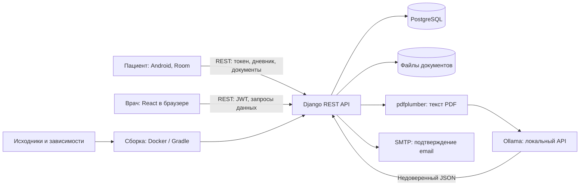

# Проект: HelpHealth — целевой Secure SDLC учебного прототипа

> **Примечание к публикации в GitHub (27.09.2026).** Основной текст и E01–E08 описывают первоначальный снимок курсовой до импорта. При публикации отдельно убраны встроенные секреты и личный SMTP-адрес, настройки вынесены в окружение, добавлены безопасные значения по умолчанию и исключения для локальных файлов. Это частично меняет исходное состояние R3/R6, но не подтверждает их полное закрытие или отзыв секретов. Изменения, сделанные после подготовки основного текста, описаны в [publication-check.md](evidence/publication-check.md). Исторические формулировки «код не изменялся» ниже относятся к этапу подготовки первоначального документа.

**Участники:** Белова О.И., Кокоева М.Р.  
**Редакция:** 27.09.2026, подготовка к промежуточной защите.  
**Планируемый выпуск:** `release-v1`, локальная учебная демонстрация на синтетических данных.

> Документ подготовлен по шаблону и предоставленному снимку курсовой работы. Разделы 1–5 описывают контекст, подтверждённое состояние и предлагаемый процесс. В разделах 6–10 отдельно обозначены выполненный статический просмотр и будущая апробация. Исправление кода, запуск приложения, согласование обязанностей участниками и успешные проверки не заявляются как выполненные. План инструментов можно уточнить после лекций 06–08 с сохранением связи «риск — проверка — свидетельство».

## 1. Паспорт проекта

### Продукт, выпуск и исходная точка

HelpHealth — учебный прототип системы дистанционного наблюдения за пациентами из групп риска: пожилыми людьми, людьми с хроническими заболеваниями и жителями удалённых территорий. Пациент использует Android-приложение, врач — web-интерфейс. Возможный контекст дальнейшего применения — поликлиники, частные медицинские центры и телемедицинские сервисы; внедрение в этих организациях не подтверждено.

По исходному описанию продукт разработан Беловой О.И. как индивидуальная курсовая работа первого курса магистратуры. В рамках настоящего проекта предлагается работа двух участников над безопасностью этого прототипа. Отдельные подразделения QA, DevOps и эксплуатации не предполагаются.

- **Репозиторий, указанный автором:** [Olga-Belova-oibelova](https://git.cs.hse.ru/edu/sse/2025_26/term-papers/Olga-Belova-oibelova). Удалённый репозиторий при подготовке не проверялся.
- **Фактически исследован:** локальный каталог `Olga-Belova-oibelova-main`, предоставленный пользователем. Это снимок исходников без каталога `.git`.
- **Обозначение `final` от 20.06.2026:** перенесено из исходного шаблона как сведения автора; существование соответствующего тега/коммита в снимке установить нельзя.
- **Идентификация исходников:** 132 файла в [SHA-256-манифесте](evidence/snapshot.sha256); служебные каталоги IDE, сборки и `.DS_Store` исключены. SHA-256 самого манифеста: `45369a63d8cc354ba108f21fd5cc449fc84e7968fc173c1e9308bf79156095cf`.
- **Состав `release-v1`:** проверенный исходный снимок, инструкция локального запуска, согласованная конфигурация, тесты выбранных границ доступа, результаты проверок и решение о выпуске. Android и web входят в границы оценки; успешная сборка каждого компонента пока не подтверждена.
- **Среда выпуска:** изолированный локальный стенд; только вымышленные пациенты, документы и учётные данные, без отправки писем реальным адресатам. Внешний доступ и эксплуатация с реальными медицинскими данными в этот выпуск не входят.

### Контекст, пользователи и функции

**Пациент** регистрируется, ведёт дневник, загружает документы и просматривает врачебные записи. **Врач** регистрируется, привязывает пациента по шестизначному коду, просматривает сведения о нём, создаёт записи и планирует приёмы. Заинтересованные стороны — автор курсовой, оба участника проекта, преподаватель, а в перспективе — пациенты, врачи и медицинские организации.

В исходниках представлены регистрация и вход, связь врач–пациент, показатели здоровья, дневник, документы, лабораторные показатели, врачебные записи, уведомления и приёмы. Android использует локальную БД Room и REST-клиент; web — React и графики. Работоспособность полного пользовательского сценария ещё предстоит подтвердить.

Следует различать замысел и реализацию. В Android есть генератор демонстрационных показателей `MockGenerator` и вызов `refreshMockData`; подключение реальных носимых устройств этим не доказано. В обработке PDF извлекается **текст**, который передаётся модели `qwen2.5:7b` через локальный OpenAI-совместимый API Ollama. Передача изображений в VLM в просмотренном коде не реализована. Извлечённые результаты нельзя считать подтверждёнными медицинскими заключениями.

### Границы

**В объект оценки входят:** Kotlin/Android-приложение `HealthMonitor/`; React-приложение `frontend/`; API Django REST Framework `backend/`; модели и миграции PostgreSQL; хранение загруженных файлов; цепочка PDF → текст → LLM → результаты анализов; настройки SMTP; Dockerfile, Compose, Gunicorn и Nginx; манифесты зависимостей и имеющиеся тесты.

**Внешние зависимости:** носимые устройства и их API; операционная система телефона и браузер; SMTP; Ollama и веса модели; PostgreSQL, Docker и Nginx как сторонние продукты; GitLab и потенциальная инфраструктура размещения. Их собственная реализация не аудируется, но параметры подключения, открытые порты, версии, права и обработка ответов входят в анализ HelpHealth.

**Вне работ курса:** исследование облачной инфраструктуры без предоставленного доступа, реальные медицинские данные, полноценный клинический пилот, подтверждение нормативного соответствия и разработка промышленного CI/CD. Отсутствие CI/CD не освобождает от ручных контрольных точек, фиксации версии и сохранения результатов.

### Компоненты и границы доверия



Схема показывает логические взаимодействия по коду, а не подтверждённую работоспособность развёртывания. В снимке клиентские обращения используют HTTP; HTTPS ниже является целевым требованием для сетевого использования.

| Граница | Что пересекает | Значение для решений |
|---|---|---|
| TB1: устройство/браузер → API | Учётные данные, токены, медицинские сведения | Серверная аутентификация, проверка входа, защита транспорта; клиент не определяет права |
| TB2: пациент ↔ другой пациент ↔ врач | Идентификаторы объектов, связь с врачом, команды чтения/изменения | Доступ к каждому объекту и полю проверяется по субъекту и активной привязке |
| TB3: API → БД/файлы | Медицинские сведения и документы | Закрытый доступ к БД, минимальные права, защищённая выдача файлов и резервное восстановление |
| TB4: PDF → парсер → LLM → БД | Недоверенный файл, текст и JSON модели | Ограничения ресурсов, проверка схемы и значений, прослеживаемость до документа, отсутствие автоматического доверия результату |
| TB5: приложение → локальное хранилище Android | Токен, локальные показатели | Ограничить хранение, резервирование и журналирование; отдельно проверить поведение при выходе |
| TB6: исходники/зависимости → сборка/стенд | Код, пакеты, образы, конфигурация | Фиксировать снимок и версии, проверять секреты и согласованность настроек |
| TB7: API → SMTP | Адрес и токен подтверждения | Отдельный секрет и ограничение его доступа; на стенде — почтовая заглушка |

### Активы и существенные риски

| Актив | Что может произойти | Почему существенно и какое решение следует |
|---|---|---|
| A1: профили, диагнозы, дневники, документы | Чтение чужих данных без входа либо по изменённому ID | Нарушается конфиденциальность; приоритет — авторизация API и файлов |
| A2: показатели, результаты анализов, врачебные записи | Подмена владельца, автора или числовых значений | Врач получает недостоверную картину; нужны права записи и проверка происхождения данных |
| A3: пароли, токены, ключ Django, SMTP-секрет | Раскрытие в ответах API, коде, HTTP или логах | Возможна компрометация учётных записей/сервисов; исключение секретных полей и отзыв опубликованных секретов |
| A4: доступность API и обработчика PDF | Большой/сложный файл, множество фоновых потоков, зависание LLM | Пользователь не получает данные; нужны лимиты, тайм-ауты, управляемая обработка |
| A5: исходники, зависимости и выпуск | Развёрнут другой снимок или непроверенная конфигурация | Нельзя связать проверку с выпуском; нужен манифест и повторяемый запуск |
| A6: локальная БД и журналы | Остаточные данные после выхода, избыточное логирование | Утечка за пределами серверного контроля; нужен отдельный обзор Android и политики журналов |

### Доступные материалы и ограничения

- [x] Исходный код и перечни зависимостей: Poetry, npm, Gradle.
- [x] Файлы сборки, миграции, конфигурация приложения и контейнеров.
- [x] Авторское описание архитектуры в исходном шаблоне; оно сверялось с кодом.
- [x] Три найденных тестовых файла; это шаблонные тесты Android/React, а не доказательство покрытия рисков.
- [ ] Git-история, проверенный commit SHA и история review.
- [ ] Содержательная инструкция запуска: корневой `README.md` пуст; frontend README — типовое описание Create React App.
- [ ] Подтверждённая сборка и успешный запуск всех компонентов.
- [ ] Доступный тестовый стенд, CI/CD, журналы прежних проверок и сведения о реальном развёртывании.

**Недоступно:** состояние удалённого сервера, настройка реальных устройств, история инцидентов, действия внешних пользователей и действительность найденных секретов. Отсутствие этих материалов в архиве не доказывает их отсутствие у автора.

**Конфиденциальность:** в отчёты не включаются значения секретов, токены и реальные медицинские документы. Исходники содержат секретоподобные настройки; их работоспособность не проверяется. До любой передачи архивов их необходимо удалить, а потенциально действующие значения — отозвать/заменить силами владельца. Для тестов использовать синтетические данные; SMTP и LLM сначала заменить локальными заглушками.

**Почему проект выполним:** уже доступен статический анализ критических путей. Для динамической части достаточно одного локального стенда, двух врачей и двух пациентов. Главный результат курса — исправление выбранной границы доступа, негативные и позитивные тесты, повторный прогон и обоснованное решение о выпуске. Если стенд не удастся поднять, останутся проверяемые статические результаты, но динамические контрольные точки будут считаться непройденными.

## 2. Методологическая основа

**Основная рамка — NIST SSDF 1.1, SP 800-218 (2022).** Она описывает практики подготовки процесса, защиты программного обеспечения, безопасной разработки и реагирования на уязвимости; допускает адаптацию по риску и ресурсам. Используется именно зафиксированная версия 1.1. [Официальный документ NIST](https://csrc.nist.gov/pubs/sp/800/218/final).

**Дополнительный источник — OWASP ASVS 5.0.0.** Используется выборочно для проверяемых технических требований web/API, прежде всего авторизации, файлов и защиты данных. Полное соответствие стандарту или уровню ASVS не заявляется. [Официальная страница ASVS](https://owasp.org/projects/asvs).

**Обоснование:** SSDF связывает найденные проблемы с ответственностью и выпуском, что важно для команды из двух человек. ASVS помогает сформулировать ожидаемое поведение API. Приведённые ниже конкретные правила, сроки, роли и пороги являются адаптацией для HelpHealth, а не дословными требованиями стандартов.

**Рассмотренные альтернативы:** оценка зрелости OWASP SAMM полезна в длительной программе развития, но не выбрана основной задачей этого короткого проекта; перечня OWASP Top 10 недостаточно для назначения ролей и решения о выпуске; отдельная полная программа мобильной проверки пока несоразмерна объёму курса. Для Android остаётся ограниченный обзор транспорта, токенов и логов без заявления о полном покрытии.

| Положение | Смысл положения | Адаптация к HelpHealth: действие, роль, результат | Критерий выполнения |
|---|---|---|---|
| SSDF PO.1 | Определить требования безопасности | Белова описывает активы, выпуск и матрицу прав, Кокоева проверяет негативные сценарии | Для чувствительного ресурса определены субъект, операция и ожидаемый отказ |
| SSDF PO.2 | Определить ответственность | Распределить два самостоятельных участка и перекрёстную проверку | У каждой задачи есть исполнитель и другой проверяющий |
| SSDF PO.4 | Задать критерии проверок | Обе участницы применяют G0–G4 из раздела 4 | Ни один обязательный пункт не закрыт без свидетельства |
| SSDF PS.1, PS.3 | Защитить код и сохранить выпуск | Кокоева ведёт манифест/commit; Белова проверяет состав; отчёты без секретов | Исходники и результаты однозначно связаны с версией |
| SSDF PW.1 | Учитывать риск при проектировании | Белова пересматривает TB2/TB4 при изменении API или PDF-потока | Для новой границы есть угроза, правило и проверка |
| SSDF PW.7, PW.8 | Анализировать код и проверять исполняемый продукт | Обе участницы выполняют обзор своих участков и тесты на стенде | Есть воспроизведение, решение по результату и независимый повтор |
| SSDF PW.9 | Задать безопасные настройки | Кокоева готовит конфигурацию стенда без рабочих секретов и открытой БД | Проверены эффективные настройки, а не только `.env` |
| SSDF RV.2, RV.3 | Устранить проблемы и причины | Белова исправляет доступ; Кокоева повторяет сценарии и ищет аналогичные места | Отказ чужому пользователю и доступ законному подтверждены тестами |

Источник значений идентификаторов — [таблица практик SSDF 1.1](https://nvlpubs.nist.gov/nistpubs/SpecialPublications/NIST.SP.800-218.pdf). Реализация может быть ручной; внедрение CI/CD не является предварительным условием.

Дополнительная конкретизация по ASVS:

| Положение | Применение | Владелец и свидетельство |
|---|---|---|
| ASVS v5.0.0-8.1.1, 8.1.2 | Описать доступ к операциям, объектам и полям, включая запрет чтения токена/хеша пароля | Белова: матрица прав; Кокоева проверяет полноту |
| ASVS v5.0.0-8.2.1–8.2.3, 8.3.1 | Проверять права на сервере при list/detail/create/update/delete; фильтр из запроса не определяет права | Белова: изменение API; Кокоева: негативные и позитивные тесты |
| ASVS 5.0.0, V5 | Обосновать обработку и выдачу недоверенных файлов | Кокоева: лимиты, набор синтетических PDF; Белова: обзор пути сохранения/выдачи |
| ASVS 5.0.0, V14 | Ограничить раскрытие чувствительных данных | Кокоева: обзор журналов/ответов; Белова: проверка отсутствия данных в артефактах |

Источники: [V8 — авторизация](https://github.com/OWASP/ASVS/blob/v5.0.0/5.0/en/0x17-V8-Authorization.md), [V5 — файлы](https://github.com/OWASP/ASVS/blob/v5.0.0/5.0/en/0x14-V5-File-Handling.md), [V14 — защита данных](https://github.com/OWASP/ASVS/blob/v5.0.0/5.0/en/0x23-V14-Data-Protection.md). Для V5/V14 пока выбраны направления; точные требования для апробации будут зафиксированы до запуска, без заявления о проверке всей главы.

## 3. Текущее состояние

### Что подтверждено

Исходники организованы как три компонента, имеются контейнерные файлы и миграции. По скрипту `backend/docker-cmd.sh` запуск предполагает миграции, импорт справочников и Gunicorn. В Dockerfile backend используются Python 3.10, Poetry и отдельно устанавливаемый Gunicorn; frontend собирается через `npm install`. В `backend/pyproject.toml` заявлены Django 4.2.30 и DRF 3.14; в `frontend/package.json` — React `^19.2.4` и `react-scripts` 5.0.1; Android содержит Gradle wrapper 8.4. Это версии/ограничения из файлов, не измерения работающей среды.

Есть отдельные полезные меры: хеширование паролей в регистрационных обработчиках, случайные токены через `secrets`, JWT для врача, срок токена подтверждения email, фильтрация собственных связей в `DoctorPatientAssignmentViewSet`. Но эти меры не обеспечивают единообразную защиту остальных ресурсов.

История фактических review, выпусков и ручных проверок не предоставлена. Поэтому нельзя утверждать, что разработчик никогда их не выполнял. Установлено более узкое обстоятельство: в снимке нет сохраняемых свидетельств этих проверок. [Инвентаризация](evidence/inventory.json), [исходные свидетельства](evidence/source-review.md).

### Существенные разрывы

Приоритет определяется влиянием на A1–A6 и близостью к доступному интерфейсу. **Высокий** — блокирует затронутый сценарий выпуска; **средний** — требует исправления или ограниченного исключения. Это проектная оценка риска, не рассчитанный CVSS. Подтверждение по исходникам не равно воспроизведению атаки на работающем сервере.

| ID / приоритет | Разрыв и почему важен | Свидетельство | Следствие для выпуска |
|---|---|---|---|
| R1 / высокий | Не задана обязательная аутентификация и изоляция медицинских ресурсов. Для ряда viewset используется полный queryset; параметры фильтра контролирует клиент | `settings.py:111–119` — `AllowAny`, JWT; `views.py:178–182, 311–318, 374–454`; [E01](evidence/source-review.md#e01) | До проверки и исправления нельзя допускать пользователей к этим ресурсам. Смена ID и запрос без фильтра входят в обязательные тесты |
| R2 / высокий | Сериализатор пациента включает все поля модели, в том числе поле хеша пароля и токен; вложенная выдача пациента тоже использует его | `serializers.py:119–133`, `models.py:261–292`; [E02](evidence/source-review.md#e02) | Убрать секретные поля из чтения; проверить прямой и вложенный ответы. Получение реального ответа пока не выполнялось |
| R3 / высокий | Ключ Django и SMTP-пароль заданы в коде; включён DEBUG, разрешён wildcard хостов. Учётные данные БД записаны в конфигурации | `settings.py:9–13, 66–75, 141–147`, `docker-compose.yml:6–37`; [E03](evidence/source-review.md#e03) | Требуются очистка и замена потенциально действующих секретов владельцем, безопасный профиль; значения не публикуются |
| R4 / высокий при сетевом использовании | Android обращается по HTTP и допускает cleartext; включён BODY-лог. Backend печатает извлечённый результат анализа | `NetworkModule.kt:15–24`, Android manifest/config; `views.py:346–349`; [E04](evidence/source-review.md#e04) | Защитить транспорт и убрать чувствительные данные из логов. До этого — только изолированный стенд с синтетикой |
| R5 / высокий для сценария документов | Лимит 25 MB и проверка расширения находятся в `DocumentParseSerializer`, но upload использует другой сериализатор. На загрузку создаётся поток; полноценная схема ответа LLM и проверка медицинского смысла не показаны | `serializers.py:136–168`, `views.py:283–308, 320–363`, `conv.py:69–79`; [E05](evidence/source-review.md#e05) | Проверить фактический upload-путь, лимиты, владельца, выдачу файла и отказоустойчивость. До этого отключить обработку документов либо отложить полный выпуск |
| R6 / высокий для воспроизводимости | Compose передаёт DB_HOST и другие переменные, но Django использует литералы с `localhost`; адрес Ollama тоже localhost. В контейнере это адрес самого контейнера | `settings.py:66–75`, Compose, `conv.py:7–11`; [E03](evidence/source-review.md#e03), [E06](evidence/source-review.md#e06) | Сначала согласовать конфигурацию; успешность старта из имеющихся файлов не подтверждена |
| R7 / средний, проверка обязательна перед выпуском | Нет найденных backend-тестов изоляции доступа; имеющиеся три файла проверяют шаблонные сценарии | [Инвентаризация](evidence/inventory.json), [E07](evidence/source-review.md#e07) | Нужны регрессионные проверки R1/R2. Проблема — отсутствие свидетельств защиты, а не формальная незрелость процесса |
| R8 / средний | Проверка диапазона `value < 0 and value > 100` никогда не отклоняет обычное числовое значение; вывод LLM сохраняется после ограниченного преобразования | `validators.py:48–52`, `views.py:283–308`; [E08](evidence/source-review.md#e08), [E05](evidence/source-review.md#e05) | Добавить граничные значения и недоверенные ответы в тесты; ошибка диапазона подтверждена логикой кода |

Дополнительное наблюдение к R1: Android отправляет `Token`, тогда как глобально подключена только JWT-аутентификация; `get_patient_from_token` определена, но её вызовов в API не найдено. Просто заменить `AllowAny` на `IsAuthenticated` недостаточно: нужно встроить аутентификацию пациента и сохранить законные сценарии. [E01](evidence/source-review.md#e01).

Для `/media/` обнаружены маршруты без проверки владельца, но реальная выдача зависит от способа запуска и подключения volume. Доступность чужого файла по URL пока является гипотезой, а не подтверждённым сетевым результатом. Используемый frontend Dockerfile копирует `frontend/nginx.conf`; отдельный `nginx/default.conf` нельзя считать автоматически активным.

## 4. Целевой Secure SDLC

### Ответственность

Распределение ниже — предлагаемый план, который участницы должны подтвердить перед исполнением; он не описывает уже выполненный ими вклад.

| Участник | Самостоятельный содержательный участок | Решения и перекрёстная проверка |
|---|---|---|
| Белова О.И. | Архитектура, аутентификация пациента, матрица доступа и исправление API/сериализаторов | Объясняет продуктовые правила; проверяет конфигурацию и результаты Кокоевой |
| Кокоева М.Р. | Модель угроз для конфигурации/данных, негативные тесты доступа, обзор секретов, транспорта и PDF | Самостоятельно воспроизводит проблемы и исправления Беловой; ведёт реестр результатов |
| Обе участницы | Триаж, исключения, фиксация версии и решение о выпуске | Изменение не принимает только его автор; для выпуска нужны оба подтверждения |

Преподавателю эскалируются разногласия о масштабе и достаточности свидетельств. Это не замена технической проверки и не разрешение на обработку реальных данных.

### Целевые правила доступа

| Субъект | Разрешено | Запрещено |
|---|---|---|
| Анонимный | Регистрация/вход, подтверждение email, явно выбранные общедоступные справочники | Любые медицинские данные, файлы, списки пациентов и уведомления |
| Пациент P1 | Собственный профиль в ограниченном составе; свои дневники, показатели и документы; чтение своих врачебных записей | Данные P2; назначение себя другим владельцем; создание записи от имени врача |
| Врач D1 | Собственный профиль, уведомления и данные пациентов с активной связью; свои записи/приёмы в рамках такой связи | Данные непривязанного пациента; чужие уведомления и изменение профиля D2; токен/хеш пароля пациента |
| Врач после архивации связи | Собственный профиль и разрешённые несвязанные операции | Доступ к текущей медицинской карте бывшего пациента; для учебного выпуска доступ прекращается сразу |

Для удаления/редактирования медицинских записей разрешение должно быть явно задано по типу ресурса; пока такого продуктового правила нет, операция запрещается. Связь, присланная в теле запроса, сверяется с субъектом; принадлежность объекта не доверяется клиенту. Код привязки требует ограничения попыток и определённого срока/порядка отзыва; знание кода не должно открывать обход проверок на следующих запросах.

### Этапы и контрольные точки

| Этап / точка | Обязательная работа на каждый выпуск | Исполнитель → проверяющий | Сохраняемый результат | Условие перехода |
|---|---|---|---|---|
| Планирование / G0 | Зафиксировать исходники, границы, состав выпуска, активы и 5–8 приоритетных сценариев | Белова → Кокоева | Манифест/commit, карта рисков, матрица прав | Обе участницы одинаково понимают разрешённый доступ и исключённые функции |
| Проектирование / G1 | Для изменения указать угрозу, ожидаемое поведение и тест; проверить влияние на клиента | Автор изменения → партнёр | Задача/запись с критериями приёмки | Есть позитивный и негативный сценарий, нет неявного обхода контроля |
| Реализация / G2 | Проверить diff, секреты, сериализацию и эффективные настройки; обновить тесты | Автор → партнёр | Изменение, review, результаты статического анализа | Нет новых секретов; замечания высокого приоритета устранены; изменение проверено партнёром |
| Проверка кандидата / G3 | Поднять чистый стенд; выполнить матрицу API, проверки конфигурации и выбранного улучшения | Кокоева для API; Белова для конфигурации | Команды, версии, конфиг без секретов, результат и код возврата | Все обязательные сценарии выполнены; непройденный/не запущенный тест не считается успешным |
| Выпуск / G4 | Сопоставить версию с G3, рассмотреть риски и исключения, подготовить откат | Обе участницы | Решение о выпуске, состав, ограничения, инструкция отката | Нет незакрытых высоких рисков в включённых сценариях; исключения ограничены и подписаны обеими |
| После выпуска | При сообщении о дефекте локализовать затронутую функцию, повторить сценарий, исправить причину | Владелец участка → партнёр | Запись дефекта, регрессионный тест, обновлённое решение | Новый кандидат повторно прошёл затронутые точки |

**Практики по риску:** при изменении авторизации расширяется матрица субъектов и операций; при PDF/LLM — тесты вредоносного формата, объёма, тайм-аутов и недостоверного JSON; при сетевом размещении — HTTPS и проверка реальной выдачи файлов; при смене зависимостей — анализ advisories и применимости находок; при изменении Android-хранилища — проверка выхода, резервирования и остаточных данных. Эти проверки не запускаются формально на каждое изменение текста документа.

### Исключения, принятие риска и эскалация

Карточка исключения содержит ID риска, затронутый сценарий и версию, причину отсрочки, компенсирующую меру, владельца, срок, способ проверки меры и подтверждения обеих участниц. Срок — до следующего кандидата, не более двух недель. Просроченное исключение блокирует G4.

Высокий риск чужого доступа, раскрытия секретов или подмены медицинских данных не принимается для включённой функции. Возможен более узкий выпуск с технически отключённой функцией, обновлёнными границами и повторной проверкой; это новый состав выпуска, а не запись «риск принят». Неполная динамическая проверка не заменяется согласием участников.

Обнаруженный вероятно действующий секрет сразу передаётся владельцу без копирования значения в общий отчёт. Владелец отзывает его и фиксирует факт замены без нового значения. При разногласии выпуск откладывается, вопрос о масштабе выносится преподавателю. Повторная проверка выполняется до снятия блокировки.

**Откат:** сохранить предыдущий проверенный снимок и копию синтетической БД; при дефекте остановить стенд, восстановить согласованную версию и данные, повторить контрольные сценарии. Резервные копии с реальными данными в курсовом стенде не используются.

### Что реалистично выполнить в рамках курса

Рабочая оценка — четыре недели, **48 человеко-часов на двоих**, включая резерв; это допущение планирования, а не подтверждённое расписание курса.

| Период | Объём | Основной результат | Ответственные |
|---|---:|---|---|
| Неделя 1 | 8 ч | Согласовать требования, очистить конфиг, поднять локальный backend с БД и заглушками | Кокоева — конфиг; Белова — модель данных |
| Неделя 2 | 12 ч | Воспроизвести выбранные проблемы и подготовить матрицу доступа | Кокоева — тесты; Белова — разбор причин |
| Неделя 3 | 16 ч | Исправить аутентификацию/авторизацию и секретные поля, выполнить review | Белова — код; Кокоева — независимые проверки |
| Неделя 4 | 8 ч + 4 ч резерва | Повторить проверки, оформить результаты, согласовать состав и решение | Обе участницы |

Если к концу первой недели запуск не восстановлен, исключить LLM-интеграцию из ближайшей апробации, заменить её заглушкой и сосредоточиться на API. Если весь включённый медицинский API не укладывается в срок, явно сузить выпуск и отключить непроверенные маршруты. Нельзя объявлять весь исходный продукт готовым по тестам одного endpoint.

## 5. Технологический профиль

### Метод 1. Анализ и проверка авторизации API

**Риск/цель:** R1/R2, граница TB2; доказать изоляцию пациентов, допустимые действия врача и отсутствие секретных полей в ответах.  
**Область:** маршруты пациента, документов, дневника, показателей, записей, уведомлений и приёмов; аутентификация пациента и врача; прямая и вложенная сериализация.  
**Этап:** проектирование, review, G3 и повтор после исправления.  
**Способ и версии:** ручной анализ по ASVS 5.0.0 и тесты `django.test`/DRF `APIClient`; заявленные в backend версии Django 4.2.30 и DRF 3.14. Фактические версии после установки зафиксировать отдельно.  
**Ведущая:** Белова О.И. — модель прав, причины дефектов и исправление.  
**Проверка партнёром:** Кокоева сама создаёт данные D1/D2, P1/P2, меняет ID и владельца, запускает тесты на исходном и исправленном снимках.  
**Ожидаемые свидетельства:** матрица запросов/ожиданий, тесты, обезличенные результаты до/после, ссылка на изменение и повтор партнёра.  
**Не покрывает:** безопасность ОС, браузера и реального TLS, все бизнес-сценарии, инфраструктуру. `APIClient` проверяет приложение, но не конфигурацию обратного прокси.

### Метод 2. Обзор конфигурации, секретов и воспроизводимости

**Риск/цель:** R3/R4/R6/R7, TB1/TB6/TB7; получить воспроизводимый стенд и исключить явные небезопасные настройки.  
**Область:** Django settings, Compose, оба Dockerfile, активная Nginx-конфигурация, lock-файлы, Android network config и журналирование.  
**Этап:** подготовка среды, review, перед G3/G4.  
**Способ и версии:** выполненный просмотр — ripgrep 15.2.0 и сборщик `collect_snapshot.py` 1.0 на Python 3.14.5; далее — `manage.py check --deploy`, проверка эффективных переменных и Compose. Версии Docker/Compose/Poetry на будущем стенде пока не измерены; их нужно записать до запуска. Автоматический сканер секретов можно выбрать после лекций 06–08; выбор не считается уже выполненной проверкой.  
**Ведущая:** Кокоева М.Р. — конфигурация, протокол и анализ результатов.  
**Проверка партнёром:** Белова запускает по инструкции в чистой среде и проверяет, что приложение реально читает новые настройки и не отправляет письма наружу.  
**Ожидаемые свидетельства:** версии, конфигурация без значений секретов, протокол запуска и checks, реестр замечаний, подтверждение замены секретов владельцем.  
**Не покрывает:** Git-историю без её получения, действительность секретов, неизвестные уязвимости зависимостей. Наличие lock-файла и успешный `check --deploy` не доказывают безопасность приложения.

### Метод 3. Ограниченная проверка PDF/LLM-потока

**Риск/цель:** R5/R8, TB4; проверить безопасный отказ и сохранение только допустимых результатов.  
**Область:** фактически используемый upload-сериализатор, размер/тип файла, очередь/поток, ответ LLM, привязка результата к владельцу, выдача документа.  
**Этап:** проектирование обработки документов, G3 при включении функции в выпуск.  
**Способ и версии:** ручной разбор и тесты Django/DRF с заглушкой LLM. Для будущего интеграционного прогона зафиксировать точные установленные версии `pdfplumber`, `openai`, `json-repair`, Ollama и идентификатор модели: ограничение в pyproject и имя `qwen2.5:7b` сами по себе не идентифицируют исполняемую среду.  
**Ведущая:** Кокоева М.Р. — набор граничных случаев и протокол.  
**Проверка партнёром:** Белова сопоставляет сценарии с кодом сохранения и повторяет минимум допустимый PDF, недопустимый файл и отказ LLM.  
**Ожидаемые свидетельства:** синтетические файлы, фиксированные JSON-ответы заглушки, ожидаемый/фактический статус, отсутствие неверных строк в БД, проверка очистки временных файлов.  
**Не покрывает:** клиническую точность, все форматы отчётов, устойчивость модели ко всем prompt injection, полноценный нагрузочный аудит. Заглушка проверяет обработку ответа, а не качество самой модели.

## 6. Практическая апробация

### Выполнено на этапе подготовки документа

Выполнены чтение исходников и конфигурации, поиск обработчиков и тестов, сопоставление URL → viewset → serializer → model, фиксация хешей и обезличенных выдержек. Приложение, Docker-сборка, реальные SMTP/Ollama, автоматические тесты и сканеры зависимостей не запускались. Версии среды просмотра: Python 3.14.5, ripgrep 15.2.0.

Повторить сбор свидетельств из каталога, содержащего `project.md`:

```bash
python3 evidence/collect_snapshot.py /path/to/Olga-Belova-oibelova-main /path/to/recheck-evidence
```

Последний аргумент должен указывать на каталог **вне исходного проекта**. Сборщик не импортирует и не запускает его код. Конфигурация проверяемых файлов и диапазонов строк находится в [самом сборщике версии 1.0](evidence/collect_snapshot.py).

Результаты: [инвентаризация](evidence/inventory.json), [манифест файлов](evidence/snapshot.sha256), [E01–E08 с номерами строк](evidence/source-review.md). Эти свидетельства подтверждают содержимое переданного снимка, но не поведение развёрнутого сервиса. Повтор на другой версии требует нового манифеста; старые номера строк нельзя механически считать актуальными.

### Черновой план дальнейшей апробации

До динамического запуска нужно исправить конфигурацию стенда, заменить секреты тестовыми, запретить внешний SMTP, использовать заглушку LLM и синтетическую БД. Плановые команды ниже выполняются **после** подготовки конфигурации и создания тестов; сейчас таких результатов нет.

| Метод / гипотеза | Последовательность | Ожидаемый результат и будущее свидетельство |
|---|---|---|
| M1 / H1: медицинские ресурсы можно читать без входа или вне своей привязки | Создать P1/P2, D1/D2, активную D1–P1; запросить список, чужой ID, чужой filter, изменение владельца; затем проверить законный доступ и архивирование связи | До исправления зафиксировать фактическое поведение; после — отказ без раскрытия данных, пустые/ограниченные списки, успешные законные операции. Будущий файл `evidence/api-access-before-after.md` |
| M1 / H2: секретные поля попадают в прямую/вложенную выдачу пациента | Проверить list/detail пациента и assignments с вложенным пациентом; отдельно проверить, что поле нельзя произвольно менять | Хеш пароля и токен отсутствуют в общих ответах; при входе токен отдаётся только соответствующему пациенту. Будущие тесты и журнал в `evidence/api-access-before-after.md` |
| M2 / H3: исходный Compose не соответствует эффективным settings | Сопоставить все переменные; после исправления поднять чистую БД и backend, проверить миграции, подключение и ошибки deployment checks | Согласованные параметры без рабочих секретов; команды, версии и ограничения в будущем `evidence/environment-check.md` |
| M3 / H4: реальный upload обходит подготовленную в другом сериализаторе валидацию | Допустимый PDF, неверный формат, файл сверх выбранного лимита, пустой/нечитаемый PDF, повторная загрузка; менять владельца | Отказы 4xx для недопустимого входа, отсутствие чужих/частичных данных; будущий `evidence/pdf-cases.md` |
| M3 / H5: ответ модели может повредить данные или обработку | Заглушки: нет `tests`, неверный тип массива, `null`, нечисловое значение, неверная дата/единица, тайм-аут, посторонние инструкции в документе | Контролируемый отказ/статус ошибки; нет молчаливого сохранения недостоверного результата и чувствительных логов; будущий `evidence/pdf-cases.md` |

Минимальные плановые проверки стенда:

```bash
# Из backend/, после подготовки окружения и безопасных settings:
poetry run python -m django --version
poetry run python manage.py check --deploy
poetry run python manage.py test api
```

До появления содержательных backend-тестов последняя команда не подтверждает защиту API. Полный запуск Compose и smoke-тесты Android/web нужно описать после согласования адресов и settings, а не копировать неработающую инструкцию из исходного снимка.

Для каждого будущего прогона записать дату, исполнителя, commit/манифест, версии, профиль настроек, команду, код возврата, ожидание и факт. Сохранить только обезличенный вывод. Ошибку окружения отделять от найденной уязвимости, пропущенный тест — от успешного.

## 7. Результаты и триаж

| Результат | Вывод на текущем этапе | Основание и влияние |
|---|---|---|
| R1: отсутствие общего запрета и объектной изоляции | Подтверждено по коду; динамическое воспроизведение не выполнено | [E01](evidence/source-review.md#e01). Блокирует G3/G4 медицинского API |
| R2: все поля пациента в сериализации | Подтверждено по коду; состав фактического ответа проверить на стенде | [E02](evidence/source-review.md#e02). Блокирует выпуск затронутых маршрутов |
| R3: секреты и небезопасные defaults | Подтверждено по файлам; действительность секретов не проверялась | [E03](evidence/source-review.md#e03). Очистка, безопасная конфигурация и действие владельца обязательны |
| R4: HTTP и чувствительное логирование | Подтверждено по коду; сетевой перехват не проводился | [E04](evidence/source-review.md#e04). Сетевой выпуск не допускается до устранения |
| R5: валидация PDF вне используемого пути; слабая проверка JSON | Подтверждено расположение кода; возможность DoS и доступ к файлу по URL требуют проверки | [E05](evidence/source-review.md#e05). Документный сценарий блокируется либо отключается |
| R6: несогласованные адреса/настройки | Подтверждено расхождение файлов; фактический сбой запуска не измерялся | [E03](evidence/source-review.md#e03), [E06](evidence/source-review.md#e06). G3 непройдена |
| R7: нет найденных профильных тестов backend | Подтверждено только для переданного снимка | [E07](evidence/source-review.md#e07), [инвентаризация](evidence/inventory.json). Требуется набор проверок перед выпуском |
| R8: невозможное условие проверки диапазона | Подтверждено анализом выражения; API-воспроизведение не выполнялось | [E08](evidence/source-review.md#e08). Исправить и проверить граничные значения |

Открытый доступ к справочникам сам по себе не записан в уязвимости: он может соответствовать публичной функции. Аналогично, отсутствие CI/CD не является самостоятельным доказательством небезопасности. Сканирование CVE не проводилось, поэтому конкретные уязвимости пакетов или их отсутствие не заявляются.

Состояния будущего триажа: «подтверждён», «ложное срабатывание», «неприменимо», «требует дополнительной проверки». Для каждого решения сохраняются причина, свидетельство, затронутая версия, приоритет, владелец и влияние на G4. Удаление записи без объяснения не считается триажем.

## 8. Улучшение и повторная проверка

**Текущий статус:** подготовлены описание процесса, реестр рисков и статические свидетельства. Код курсовой в рамках заполнения документа не изменялся; устранение уязвимостей и успешный результат «после» пока отсутствуют.

**Основное запланированное улучшение:** единая проверка субъекта и принадлежности медицинских данных на сервере, с явной поддержкой пациента и врача; ограниченный список полей пациента. Это уменьшает R1/R2 и закрывает наиболее прямой путь к раскрытию A1/A3.

**Состав изменения:** подключить корректную аутентификацию пациента; закрыть защищённые маршруты по умолчанию; сохранить публичными только явно выбранные действия; фильтровать объекты по пользователю и активной связи; проверять владельца/автора при записи; исключить пароль/токен из обычной сериализации. Прямую выдачу файлов проверять отдельно, поскольку закрытие JSON API не защищает автоматически `/media/`.

**Почему выбрано:** риск затрагивает центральный сценарий продукта и проверяется на небольшой синтетической базе. Исправление одного валидатора проще, но не устраняет наиболее существенный разрыв доступа.

**Ссылка на изменение:** отсутствует — изменение ещё не выполнялось. После реализации записать commit или diff и новый манифест. Предпосылки: безопасная конфигурация из M2 и воспроизводимый стенд.

**Повторная проверка:** один и тот же набор данных и запросов на исходном и исправленном снимках. Включить анонимного, P1/P2, D1/D2, активную и архивную связь, запросы без фильтра и с чужим ID, запись с чужим владельцем и вложенную сериализацию. Зафиксировать также успешность разрешённых операций: исправление не должно просто сделать API недоступным всем.

**До:** установлены опасные конструкции исходников; HTTP-ответы не измерены. **После:** ожидается запрет чужого доступа и отсутствие секретных полей; фактического результата пока нет.

**Планируемый вклад Беловой О.И.:** формализация прав, исправление аутентификации/viewset/serializer, объяснение совместимости с Android. **Планируемый вклад Кокоевой М.Р.:** независимые сценарии воспроизведения, тесты, подготовка конфигурации и сравнение до/после. Фактический вклад нужно подтвердить изменениями, протоколами и объяснением каждого участника на защите.

## 9. Решение о выпуске

**Предлагаемое решение на текущем этапе: отложить выпуск `release-v1`.** Статический документ готов для обсуждения на промежуточной защите; исполняемый кандидат не прошёл G3/G4.

**Основания:** R1–R3 затрагивают доступ к медицинским данным и секретам; R6 мешает обоснованию воспроизводимости; нет выполненных негативных проверок и подтверждённого исправления. Достаточно установленных расхождений и отсутствия обязательных свидетельств, чтобы не разрешать выпуск; это не утверждение об успешной эксплуатации всех рисков.

**Блокирующие проблемы:** есть — R1/R2/R3/R6 и непроверенный включённый сценарий документов R5. R4 блокирует сетевое использование; R7 означает отсутствие необходимого доказательства регрессии.

**Условия пересмотра:** обе участницы подтверждают безопасный стенд, корректную аутентификацию и объектный доступ, отсутствие секретных полей/рабочих ключей, успешные обязательные тесты, точную версию кандидата и ограничения. Документный сценарий должен пройти свои проверки либо быть технически отключён и исключён из состава выпуска. Владелец секретов подтверждает необходимые отзывы/замены; проверяющий не пытается использовать найденные значения.

**Остаточные риски даже после локального выпуска:** неполная проверка Android-хранилища, реальных устройств, инфраструктуры, зависимостей и точности LLM; отсутствие клинической валидации и подтверждённого производственного восстановления. Выпуск на синтетике не разрешает работу с реальными пациентами. Новый контекст требует новых требований и решения.

## 10. Метрики и программа развития

### Метрики

| Показатель | Как считать и интерпретировать | Исходное состояние / цель |
|---|---|---|
| Доля успешно выполненных обязательных сценариев доступа | Успешные сценарии / все утверждённые сценарии; пропуски входят в знаменатель | Прогоны отсутствуют; после утверждения матрицы цель G3 — 100% |
| Незакрытые высокие риски включённого выпуска | Количество записей высокого приоритета с учётом фактического состава | Сейчас высокие R1–R6; перед G4 — 0 для включённых сценариев |
| Воспроизводимость кандидата | Успешный чистый запуск и обязательные проверки партнёром для того же манифеста | Сейчас не подтверждена; цель — один независимый успешный повтор каждого кандидата |
| Полнота существенных результатов | Записи с версией, свидетельством, решением и владельцем / все существенные записи | Подсчитать при согласовании реестра; цель — 100% |
| Просроченные исключения | Число исключений после срока без повторного решения | Сейчас принятых исключений нет; цель перед выпуском — 0 |

Количество строк кода, общее число предупреждений сканера и процент покрытия сами по себе не используются как доказательство безопасности. Порог «0 высоких рисков» относится к обнаруженным и рассмотренным рискам, а не гарантирует отсутствие неизвестных.

### Программа на 6–12 месяцев

Долгосрочные пункты условны: выполняются при продолжении проекта; обязательства медицинской организации не предполагаются.

| Срок / приоритет | Действие и ожидаемый результат | Ответственный по предлагаемому плану |
|---|---|---|
| Ближайшие 1–2 недели / высокий | Очистка секретов, безопасный профиль, локальный запуск и исходный прогон API | Кокоева — среда; Белова — аутентификация; владелец — отзыв секретов |
| До конца курса / высокий | Исправление R1/R2, негативные и позитивные тесты, повтор партнёра и решение G4 | Белова — исправление; Кокоева — проверка |
| 1–3 месяца / высокий | Защищённая выдача файлов, лимиты PDF, управляемые задания, валидация JSON и отметка непроверенного результата | Кокоева — сценарии; Белова — реализация |
| 3–6 месяцев / средний | Автоматизировать уже работающие ручные проверки, фиксировать образы/инструменты, регулярно разбирать advisories | Кокоева; Белова проверяет совместимость |
| 3–6 месяцев / средний | Проверить хранение/очистку токенов и данных Android, резервирование и журналирование | Белова; Кокоева повторяет сценарии |
| 6–12 месяцев / по решению о развитии | Подготовить требования реальной эксплуатации: доступы, журнал аудита, восстановление, сроки хранения, клиническая проверка и необходимые внешние экспертизы | Обе участницы; владельцы эксплуатации и медицинской оценки должны быть определены отдельно |

## 11. Управленческая записка

HelpHealth — учебная система дистанционного наблюдения за пациентами: Android-приложение пациента, web-приложение врача и API Django с PostgreSQL. Планируемый `release-v1` ограничен локальной демонстрацией на синтетических данных. Работа с реальными пациентами, проверка облачного размещения и клиническая оценка в него не входят.

Для подготовки проекта изучен предоставленный снимок исходников, выполнены инвентаризация и статический анализ ключевых путей. Сохранены манифест из 132 файлов и выдержки с номерами строк, без значений секретов. Git-история отсутствует в переданных материалах; запуск и сборка продукта не подтверждены. Три найденных тестовых файла не проверяют изоляцию медицинских данных.

Главные разрывы — разрешающий доступ по умолчанию и неполная объектная авторизация, включение секретных полей пациента в сериализацию, секреты в конфигурации и несогласованность настроек запуска. Дополнительно выявлены HTTP и избыточное журналирование, незавершённая защита PDF/LLM-потока. Конструкции подтверждены по коду; сетевые атаки и использование найденных секретов не выполнялись.

Для команды из двух человек предложен процесс на основе SSDF 1.1 с выборочными требованиями ASVS 5.0.0: фиксированный выпуск, матрица прав, review партнёром, обязательные проверки и совместное решение о выпуске. Главный практический приоритет — серверная изоляция медицинских данных и исключение секретов из ответов. Белова отвечает за архитектуру и исправление API, Кокоева — за самостоятельные тесты, конфигурацию и повтор результата. Предварительная оценка — 48 человеко-часов на четыре недели, включая резерв.

На текущем этапе улучшена документированность: определены риски, роли, критерии и план получения свидетельств. Изменения кода и результаты «после» ещё не получены. Предлагается отложить исполняемый выпуск до исправления блокирующих проблем и успешной проверки того же кандидата партнёром. Даже после этого вывод будет относиться только к ограниченному учебному стенду; точность LLM, реальные устройства и эксплуатационные риски потребуют отдельной работы.

## 12. Использование генеративного ИИ

**Использовался ли ИИ:** да, при подготовке этой редакции документа. Наличие или отсутствие ИИ при первоначальной разработке курсовой не установлено.

**Для чего:** сопоставление шаблона и критериев с исходниками, первичная систематизация рисков, подбор и проверка методологических источников, подготовка текста, схемы, плана проверок и скрипта сбора свидетельств.

**Какие части созданы с его помощью:** эта редакция `project.md`, схема взаимодействий, реестр рисков, план Secure SDLC, материалы в `evidence/`. Исходный код продукта в рамках этой подготовки не менялся. Наличие локальной LLM в продукте для разбора PDF — отдельная функциональная особенность, а не доказательство использования ИИ автором при программировании.

**Какие данные передавались в контекст ИИ:** исходный шаблон, изображение критериев и прочитанные части предоставленного кода/конфигурации. В прочитанном конфигурационном файле присутствовали значения секретов; они не воспроизводятся в итоговом документе и выдержках. Реальные медицинские документы и учётные записи для проверки не использовались. В поисковых запросах использовались только названия открытых стандартов, без исходников и секретов.

**Как проверялся результат:** утверждения сопоставлены с файлами и строками; методологические идентификаторы — с официальными источниками; подготовлены воспроизводимые статические свидетельства. Независимая проверка участницами, согласование ролей и динамическая проверка приложения ещё не выполнены. Перед защитой каждой участнице нужно проверить и уметь объяснить свой участок, подтвердить допущения и заменить плановые статусы фактическими по мере выполнения работы.
